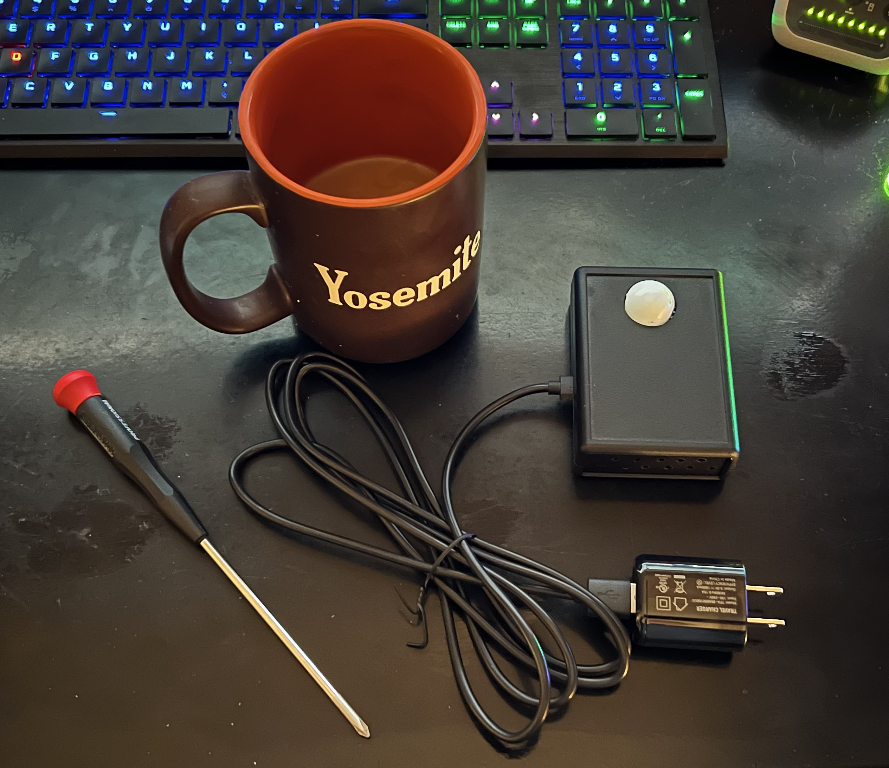

# espresence-mmwave-multi-sensor
My DIY project to build a multi sensor based on the EP1



Just like the Everything Presence One, my DIY version has an mmWave sensor, a PIR motion sensor, light illuminance, and a combo temperature/humidity sensor. Similarly it's added into Home Assistant by using the ESPHome add-on.

### Installation:
 * Download these files and copy them (keeping their subfolder paths) into your Home Assistant config/esphome main folder:

   ```
   header/leapmmw_sensor.h
   
   packages/leapmmw_sensor.yml
   ```
 
 * In Home Assistant add-on, click ESPHome>open web gui and create a new device chosing the "continue" option and give it a name such as:

   ```
   espresence-office-multi-sensor
   ```

* Click next and chose the type of ESP module you used in your build, this isn't a critical thing to have match but as long as it's some kind of ESP32 you can just select that for now and click next.
* You'll see a new card appear in the background for your ESP device, this is just an empty shell with only basic initilization code so far... click skip because you don't want to install this basic code to the ESP quite yet.
* Now click edit on your new sensor in ESPHome and you'll see the basic code:
   ```
   esphome:
    name: your-new-esp-multi-sensor

   esp32:
    board: esp32dev
    framework:
      type: arduino

   # Enable logging
   logger:

   # Enable Home Assistant API
   api:
     encryption:
       key: "cEEo6Dse5jSfuJ2FznX+3n7A6+6ZmzVNe92axpm2t04="

   ota:
     password: "488d6a3de442afaddb0250cffce64711"

   wifi:
    ssid: !secret wifi_ssid
    password: !secret wifi_password

     # Enable fallback hotspot (captive portal) in case wifi connection fails
    ap:
      ssid: "Your-New-Esp-Multi-Sensor"
     password: "RvZXGuhrPCzl"

   captive_portal:
   ```

* The esisest way to proceed is to copy all the code above out to notepad++ or your favorite editor and then paste back in the entire code from:
   ```
   espresence-multi-sensor.yaml
   ```
* Now just copy some key lines you saved from your new basic config and paste them into the relevant sections of the full config:

   ```
   substitutions:
      # change device name to match your desired name
      device_name: espresence-mmwave-multi-sensor
      # change sensor name below to the one you want to see in Home Assistant
      device_name_pretty: Multi Presence Occupancy Sensor
      # change room name below to the one you want to see in Home Assistant
      room: "Office"
   ```
* The room: "name" is key as it will be the name of each sensor object in HA so if you chose "Office" here, you sensors will be Office Motion, Office Tempurature, etc...
