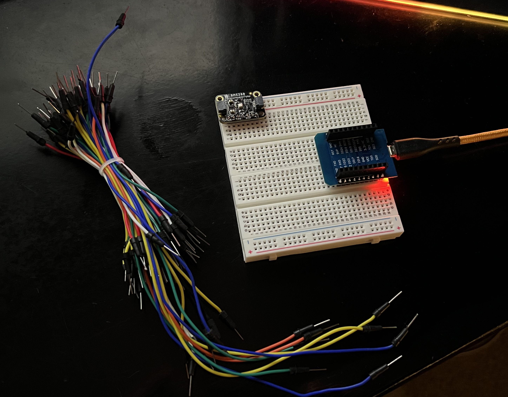
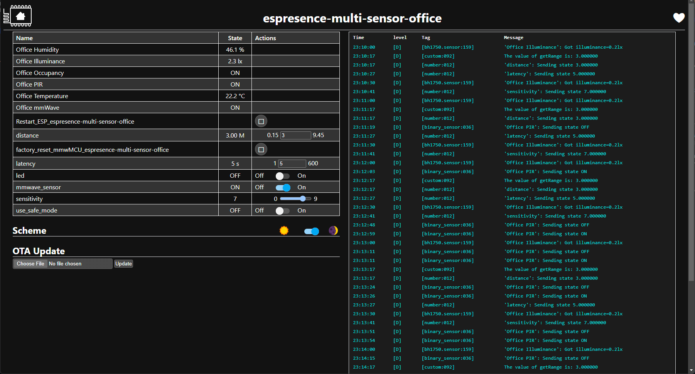
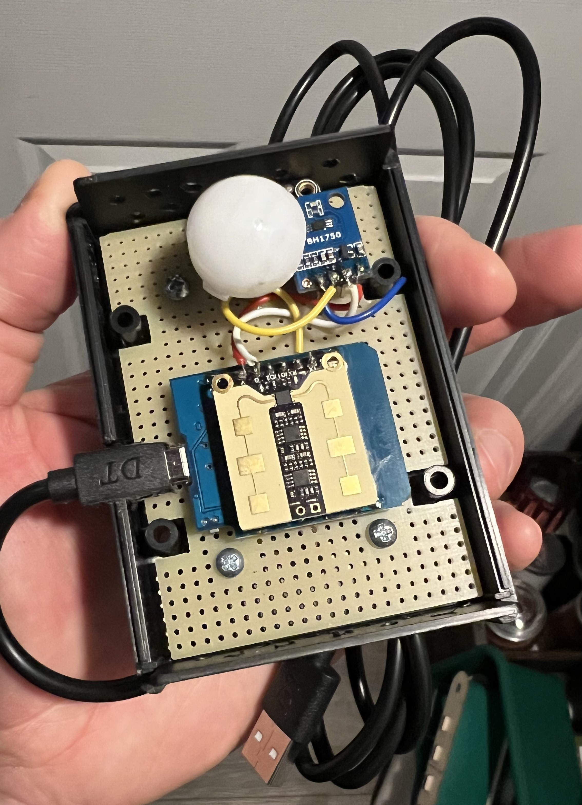
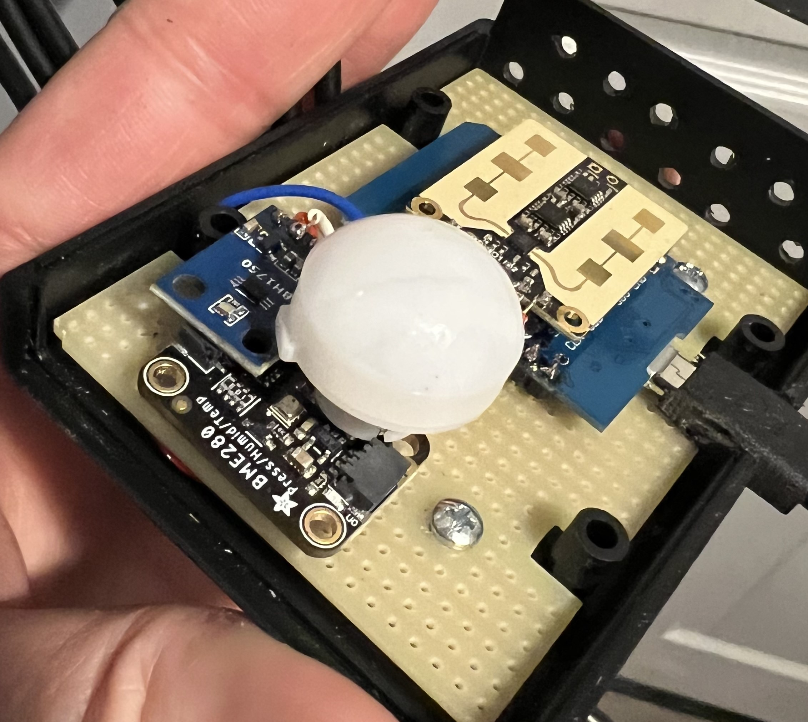

# Project Start

I had some fun and also some frustrations along the way with this project-starting very simple with the breadboard, I realized that a single breadboard, at least the ones I was used to working with, was not wide enough so I had to connect a pair of them together and have the ESP straddle the both of them in order to gain access to both sides of the ESP32 pin headers for breadboard wiring:

# Adopt/Install/or otherwise... Get Your ESP into ESPHome

Now that my ESP32 had pins and wasn't dangling on the end of a hanging USB cable, I did the install of the code, this isn't too difficult and there are many guides and several ways to do this using ESPHome either inside HA as an add-on, or by installing the tools on your PC. You may need to install a com port driver which is available on the esphome.io website my pc alread had these drivers as I had used some other random USB-COM port device and many of them share the same chipset.

# Connecting sensors...

The first connections I made were for the BME280 (Press/Humid/Temp) sensor which wasn't too hard, basically you chose pins on the ESP32 for the I2C bus, one being clock and other data (on the BME280 side it's SCK and SD1) and then wire it up! sounds easy right??? I realized the code sample I used wasn't for the BME280 but Rather some other environment sensor that looks similar but operates on another address but after a little bit I figured this out and my sensor started to come alive!

The order of my progress was very much determined by the United States Postal Service ;) so next I added in the mmWave and the PIR dome. The mmWave wasn't too hard, I soldered the header onto the mmWave and popped it onto the breadboard... why not stacked you might asked? that would make sense right?? after all the mmWave header pins align perfectly with the ESP32 (Wemos D1 mini) pins... well, again, these components arrived over time and I didn't think about the end results so I had already soldered the headers onto the ESP32 "wrong" for stacking... besides, as a breadboard project, it looks cooler this way right!?

Note: The pins for the PIR and mmWave are commented in the full config yaml file in this repo. Basically for the mmWave you need only the pull-down pin and power to see the sensor "work" but you'll definitely want the UART rx/tx connections for all the settings you can manage. These sensors come set to full power and will passthrough and detect movement on the other side of walls or in small spaces, the radar waves reflect or bounce around and you will see a lot of false positives unless you have the UART connection and can turn down the range. I haven't personally changed the sensitivity on any of the units I have now though there is that option too. Also, with the UART connections complete, you can turn off the annoying little red LED on the face of the mmWave sensor, you must first turn it on, then wait, then turn it off.
 

Once my BH1750 (illuminance) sensor arrived I found a spot for it on the now very busy looking breadboard and wired it up. Since I2C is a parallel bus, at least that's what I call it, the pins are just joined together with the BME280. On the BH1750 those pins are SCL (clock) and SDA (data) and the code I found already had the correct I2C address and descriptor for the BH1750 so it came right up :)

# Using your ESP32 built-in website for initial testing

Unless disabled, the ESP modules have a built-in webserver which is quite handy even without Home Assistant or ESPHome add-on to be able to diagnose or fine tune the settings:

Just open up a browser and pop in the ip of your device

http://your-sensor-ip

It should look something like this:

# Adding to Home Assistant

This is actually pretty straight forward. In Home Assistant, go to settings>devices and click add integration and search for esphome. You can enter the ip of the unit here and click submit, and you'll be prompted for the encryption key along with a location selector. That's about it. You'll see it listed in devices on the ESPHome card and also you'll then be able to see the device and all entities and use the states for automations or add to the dashboard.

# Building this all into an electronics project box!

I chose a nice looking black plastic electronics project box that was cheap and also had a project board inside that I could use to assemble the components. There are some inherent issues with the box I've chosen such as not much light being able to reach the illuminance sensor and even with the holes I drilled in the top/bottom plates, there isn't a lot of air flow to the temp and humidity sensors, but it works and some offsets and multipliers are provided in the code to compensate for these issues... mostly.

What isn't clear from the image above is how I stacked up the BME280>BH1750>PIR which is for several reasons, lack of space, wanting the Illuminance sensor pad to be as close to the edge of the (transparent) PIR dome as possible so it will get a bit of light and also that the PIR dome needed to be a bit raised off the project board inside the case in order to be able to poke outside the finished enclosure. Soldering the PIR dome was the trickiest part as it's pins aren't the same as header pins, they're tiny and short and I didn't have the right kind of header, or whatever it's called so I just soldered on some cut header pins and "extended" the PIR pins... ugly but worked.

The stack:

# The Completed Project

Although I like the look of my finished product:

I quickly realized that placement is key. I ended up moving up onto a wall and angling it down into the room and also off to the side, so it's not aimed at the open doorway:

The reason for this is that the PIR is great for fast motion detection and to control automatic lighting but not so great at staying in its lane ;) meaning if it sees something, even through the doorway, down the hall in another room's open door, my office lights will come on. Then promptly go back off again because of how I have my automations in HA setup to not allow lights to stay on without a human presence. So... placement! I put it where it could see the entire office space but not out into the hall and this way when someone enters the room, the PIR triggers the lights on, but then the mmWave keeps them on using its vastly superior millimeter wave motion detection. You might ask, why not just use the mmWave sensor for automatic on lights, well that works well, in fact a little too well! The mmWave will trigger on the tiniest movement such as a cat or a waving drapery or hanging decorations swayiing with natural air convection. The PIR only picks up large movement so it's perfect for human entry triggers but then pretty terrible for ongoing human presence detection.

# What My Automation Looks Like in HA Node-RED

* Use good wire! The wires you see in my project box are just cut lengths of the pile of breadboard wires I had with the cheap project kit I got online... never again! These wires are just awful to try to silver, and solder won't flow correctly as you're trying to jumper from pin to pin. For another project, I stripped an all copper power wire I had laying around and used these and it was so beautiful I almost cried as I remembered how annoying these were to work with.

# Things I learned

* Use good wire! The wires you see in my project box are just cut lengths of the pile of breadboard wires I had with the cheap project kit I got online... never again! These wires are just awful to try to silver, and solder won't flow correctly as you're trying to jumper from pin to pin. For another project, I stripped an all copper power wire I had laying around and used these and it was so beautiful I almost cried as I remembered how annoying these were to work with.
* Get the correct header for the PIR dome... no idea what it's called but I've seen it. The PIR dome from panasonic and others like it use these thin/short pins that are really not easy to work with and are meant to plug into something you solder down to your project board.
* Next time I'll use perhaps a clear piece of plastic to "bring down" some light from outside to the illuminance sensor, it's pretty easy to spot on that BH1750 module so it should not be hard to find some clear plastic part to trasfer some light to it using only a small hole on the face of the project case
* Flip the ESP32/mmWave to be over top of the temp/humd/lux/pir (stack of) sensors. I've noticed the heat rising from the ESP32 (just a small bit of warmth) is enough to mess with any accuracy of the environmental sensors and the holes I drilled top/bottom only do so much to help.
